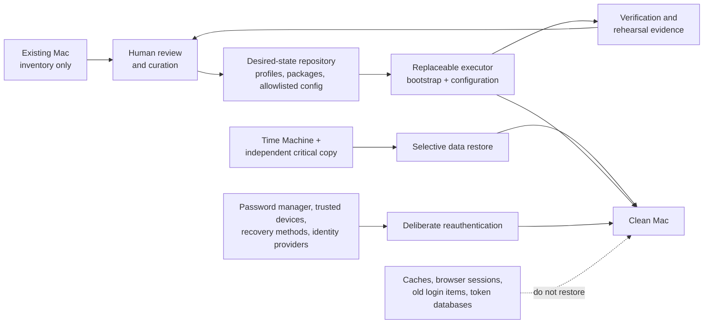

# Clean Mac regeneration architecture

## Status

**Architecture proposal with an executable prototype.**

The repository is not yet a proven one-command recovery product. Static tests,
Ansible check mode, and a GitHub-hosted macOS runner show that the files are
internally coherent. They do not prove that every cask installs, every
interactive prompt is handled, account access survives an erase, or a real
clean Mac converges to the intended workstation.

The durable asset is the model below: explicit sources of truth, narrow restore
boundaries, replaceable execution tooling, and evidence from clean-machine
rehearsals. The current shell and Ansible implementation may change without
changing that architecture.

## Goals

- Make a new Mac useful without reconstructing years of accidental state.
- Separate software, configuration, data, credentials, and ephemeral caches.
- Make the desired workstation understandable before running automation.
- Keep the smallest practical baseline and add optional capabilities in layers.
- Make every destructive or privileged action explicit.
- Improve the plan after each rehearsal so the second rebuild is easier than
  the first.

## Non-goals

- Creating a disk image or byte-for-byte clone of the old Mac.
- Storing passwords, private keys, TOTP seeds, recovery codes, browser cookies,
  OAuth tokens, or cloud credential caches in Git.
- Restoring all of `~/Library`, all applications, or all package-manager state.
- Pinning every Homebrew package version. Homebrew is a rolling-release system
  and Brewfiles do not have lock-file semantics.
- Automatically deleting software, caches, login items, or backup data.
- Treating a successful CI dry run as proof of disaster recovery.

## System model

There are five independent planes. None should silently substitute for another.

### 1. Data protection plane

Time Machine and an independent copy protect user-created data. They are the
rollback path, not the normal configuration mechanism. A backup is usable only
after a completed snapshot is visible and a representative test restore works.

### 2. Identity plane

The password manager or Apple Passwords, trusted devices, hardware keys,
recovery contacts, and provider recovery codes establish access. The new Mac
then obtains fresh application and CLI sessions through supported login flows.
Token caches are neither a backup format nor a source of truth.

### 3. Desired-state plane

Git stores reviewable intent:

- package and application manifests;
- profile composition;
- allowlisted dotfiles and preferences;
- manual application and login instructions;
- verification rules.

Generated inventories are evidence used during curation. They never replace the
desired-state files automatically.

### 4. Execution plane

The executor turns desired state into machine state. The current prototype uses
a small shell bootstrap, Homebrew Bundle, and Ansible. Ansible is an
implementation choice, not a permanent architectural dependency. It is
justified only while it makes profile composition, idempotency, check mode, and
verification clearer than a smaller alternative.

The executor must be resumable. A failure should stop with a useful message, and
rerunning after the user resolves an interactive prerequisite should continue
without duplicating state.

### 5. Verification and evidence plane

Verification compares the actual Mac with the declared profile and reports
manual gaps. A rehearsal record should capture the commit SHA, hardware and
macOS version, commands used, failures, manual interventions, elapsed time, and
the final verification result—never credentials.

## State classification

Every item on the old Mac belongs to exactly one default handling class:

| State | Examples | Regeneration method |
| --- | --- | --- |
| Recreate from code | Homebrew packages, editor settings, selected macOS defaults | Curated manifests and configuration |
| Restore selectively | Documents, photos, Obsidian vaults, irreplaceable local data | Time Machine or independent backup |
| Reauthenticate | GitHub, Apple, Google Cloud, AWS, Codex, Claude, licensed apps | Supported login flow using proven recovery methods |
| Regenerate | Machine-specific SSH keys, caches, indexes, build products | Create fresh on the new Mac |
| Discard by default | Browser sessions, OAuth caches, old login items, abandoned agents | Do not migrate |

An exception needs a named reason, source, owner, and verification step.

## Profile architecture

The target profile model is additive:

1. **core:** shell, Git, package manager, basic diagnostics, and verification;
2. **developer:** language-agnostic development and remote-workstation access;
3. **personal:** explicitly chosen desktop applications and preferences;
4. **capability packs:** cloud, containers, data, media, or other workflows that
   are installed only when currently needed;
5. **historical inventory:** discovery and rollback evidence, never an automatic
   install target.

The current `personal` profile combines several of these layers and should be
treated as a prototype pending curation. The `personal-full` Brewfile is a
historical receipt, not a profile.

Project-specific language runtimes and dependencies belong in each project's
own lock files and environment tooling. They should not be promoted to the
global workstation baseline merely because one project uses them.

## Execution contract

Any future implementation must preserve these properties:

- **inspectable:** a human can read what will be installed or changed;
- **idempotent:** rerunning converges without duplicate entries or state;
- **bounded:** the default path installs only the selected profile;
- **non-destructive by default:** cleanup, deletion, full restore, and privilege
  changes require separate explicit actions;
- **secret-free:** no secret contents in Git, reports, arguments, or logs;
- **fail-closed:** missing prerequisites and unverifiable backups stop the flow;
- **replaceable:** manifests and verification survive a change of executor;
- **evidence-producing:** every rehearsal identifies the exact reviewed commit.

## Maturity gates

| Stage | Meaning | Required proof |
| --- | --- | --- |
| M0 — architecture | Intended boundaries and decisions are documented | Architecture review |
| M1 — prototype | Scripts parse; contracts and check mode pass | Local and CI results |
| M2 — disposable rehearsal | A clean disposable Mac or macOS VM is configured without valuable data | Rehearsal record and resolved failures |
| M3 — recoverable rebuild | A real clean Mac is rebuilt with backup and identity fallbacks available | Successful selective restore, login, and verification |
| M4 — repeatable | A later rebuild succeeds from the documented process with only expected manual steps | Second independent rehearsal |

The current branch is **M1**. It must not be described as M2 or production-ready
until a clean-machine rehearsal has been completed and its findings have been
folded back into the manifests and runbook.

## Implementation plan

### Phase A: approve the architecture

- Review this document and resolve the open decisions below.
- Confirm the state-classification and trust boundaries.
- Decide which capabilities are day-one essentials.

### Phase B: build an evidence-based inventory

- Run `migration/capture-state.sh` on the existing Mac.
- Identify applications outside Homebrew and App Store management.
- Record login items and background extensions by product and purpose.
- Identify project-specific runtimes that should move out of the global profile.
- Do not capture credential contents.

### Phase C: curate manifests

- Split the current `personal` profile into the target layers.
- Apply the admission rules in `BREWFILE_GUIDE.md`.
- Remove packages that are dependencies, duplicates, experiments, or dormant
  services.
- Keep manual applications explicit without embedding licenses.
- Review every managed macOS default and dotfile fragment.

### Phase D: rehearse without risking the primary Mac

- Use a disposable Mac, a supported macOS VM, or a separately erasable volume.
- Start from the same macOS major version intended for the real rebuild.
- Execute one layer at a time and record interactive prompts and failures.
- Reboot and inspect Login Items, Activity Monitor, background services, shell
  startup, required commands, and required applications.
- Do not call the rehearsal successful merely because the executor exits zero.

### Phase E: perform a guarded real rebuild

- Satisfy every data and identity gate in `FACTORY_RESET_RUNBOOK.md`.
- Pin the reviewed commit SHA outside the Mac.
- Set up as a new Mac, execute only proven layers, and restore data selectively.
- Keep Time Machine unchanged until the rebuilt machine has been verified and
  used successfully.

### Phase F: close the loop

- Record every undocumented manual step or mismatch.
- Decide whether each mismatch belongs in code, documentation, or deliberate
  manual handling.
- Remove unused baseline items after a week of real use.
- Repeat the disposable rehearsal before the next reset.

## Open decisions

- Is Ansible still simpler than a shell bootstrap plus a dotfile manager once
  the profile is split?
- Which packages truly belong in `core`, `developer`, and optional capability
  packs?
- Which macOS defaults are important enough to manage, and which should remain
  user choices?
- Which desktop settings are worth allowlisting instead of allowing their cloud
  sync to restore them?
- Which existing SSH keys must survive, and which should be regenerated?
- What disposable macOS environment will provide the M2 rehearsal?
- What maximum elapsed time and number of manual interventions define a
  successful rebuild?

## Acceptance criteria

The architecture is ready for routine use only when:

- a future version of the owner can identify the correct entry point;
- a fresh clone at a recorded commit can reconstruct the declared baseline;
- the process never requires copying an undocumented secret or token cache;
- setup can resume after Xcode, App Store, or authentication prompts;
- verification distinguishes automated success from outstanding manual work;
- a representative file can be restored from backup;
- the primary accounts can be recovered without relying on the erased Mac;
- two clean-machine rehearsals have produced the same intended workstation
  without restoring old background state.
